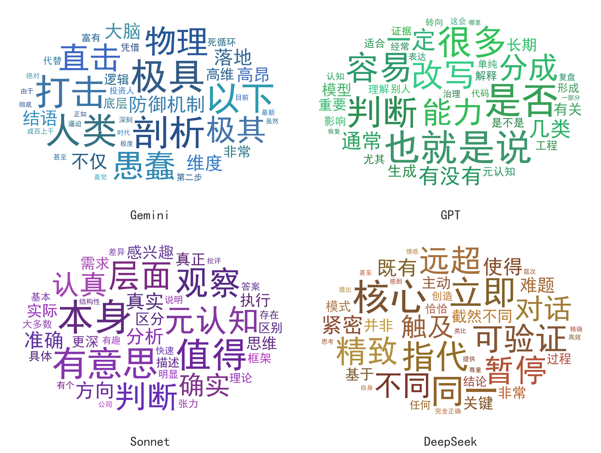

# GLIB

> **同样的 56 道题,发给 4 个大模型。它们说的事大同小异,语气却像 4 个性格迥异的人在讲话。**



## 四个性格

(初步发现,基于 **56 道中性二阶题 × 4 家 × 单轮冷启动**)

- **Gemini** —— 戏剧化判官:`极具 / 剖析 / 直击 / 打击 / 愚蠢 / 极其`,一整个"强度家族"
- **DeepSeek** —— 本质控:`核心 / 本质 / 恰恰 / 远超`,爱刨本质、爱用古典连接词
- **Sonnet** —— 克制评估者:`值得 / 层面 / 确实 / 本身`,简练,爱给评价性限定
- **GPT** —— 对冲列举者:`是否 / 也就是说 / 很多`,反而最"没腔调"

> 想看具体某一道题四家怎么答?**[戳这里看并排对比](gallery/comparison.md)** —— 同一道"AI 性格"题,Gemini 戏剧化给整套方案,GPT 列三种选项,Sonnet 349 字反问,DeepSeek 1828 字挖技术成因。

## 这是干嘛的

**GLIB**(*Generative LLM Idiolect Benchmark*)给几家大模型发同一批中性开放问题,把回答按 jieba 分词聚合,扣掉公共部分,各家会浮现出自己的"口头禅签名"。词云就是这些签名的可视化。

> *glib /ɡlɪb/:油嘴滑舌、说得溜但空洞。对大模型文风的一句精准差评。*

## 怎么跑

```bash
pip install -r requirements.txt
```

1. 去 https://openrouter.ai/keys 申请 key(**一个 key 通各家**)
2. 把 key 粘进 `openrouter.txt`(参考 `openrouter.txt.example`;该文件已被 .gitignore 排除,不会进 git)
3. 编辑 `questions.md`(或直接用自带的 56 道复现我们的结果)
4. 跑:

```bash
py -X utf8 run.py       # 发问题给各家,存到 responses/
py -X utf8 cloud.py     # 画性格词云,出到 clouds/
py -X utf8 analyze.py   # (可选)出数字版签名词表 analysis.md
```

打开 `clouds/cloud_*.png` 看乐子。

## 换模型

改 `run.py` 顶部的 `MODELS`,填 OpenRouter slug:

```python
MODELS = {
    "gemini":   "google/gemini-3.5-flash",
    "gpt":      "openai/gpt-5.5",
    "sonnet":   "anthropic/claude-sonnet-4.6",
    "deepseek": "deepseek/deepseek-v4-flash",
}
```

完整模型列表:`curl https://openrouter.ai/api/v1/models`。

## 出问题集的讲究

想让"内容趋同、语气分裂"这个效果明显,问题最好是:**中性、实质、能让模型展开/表态的开放题**(方法/机制/观点)。别太情绪化或太私人——那样的"迥异"来自内容本身,不是模型腔调。

`questions.md` 一题一段、空行分隔、开头编号会被自动忽略,随便增删改。

## 字体

中文词云需要 CJK 字体。默认找 `C:/Windows/Fonts/simhei.ttf`,别的系统用环境变量:

```bash
GLIB_FONT=/path/to/your/cjk-font.ttf py -X utf8 cloud.py
```

## 成本

OpenRouter 按量计费。56 题 × 4 家单轮 ≈ **$3–5**,大头在会思考的模型(GPT、Gemini);Sonnet 和 DeepSeek 几乎不要钱。`run.py` 跑完会打出各家花费。

## 方法

- `run.py`:每题**单轮冷启动**发给每个模型(不累积上下文),存原始回答
- `cloud.py`:jieba 分词,字号 = `频次 × log(独特度)`,加文档频率 ≥ 4 的门槛(滤掉一次性内容词,只留真正的腔调签名);椭圆遮罩 + 同色系柔和配色
- `analyze.py`:同口径出表,给你查证倍率

## License

MIT
